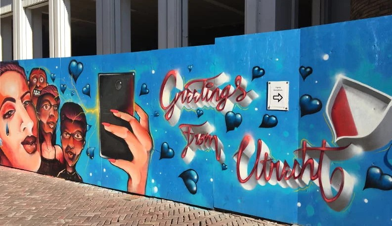

# Utrecht City Color Palette

The Dutch city Utrecht is one of the most beautiful places in the world, and a beacon of art and education, housing more than 21 universities and colleges and 400 art installations. With this package I transform street art found in Utrecht into color palettes which you can use for plots generated in R.

## How To Use

* Coming Soon

## Examples

* Coming Soon

## Installation

* Coming Soon

## Sources
- [Thirthy030, Nienke Vletter](https://www.ad.nl/utrecht/saaie-elektriciteitskastjes-niet-in-utrecht-achttien-kunstenaars-beschilderden-ze-en-dat-ziet-er-zo-uit~ad94d210/)

- [Thirty030, Patatjes4Life](https://thirty030.nl/vankastjenaarcanvasje-3/)

- [De Wonderen/The Wonders in Pijlsweerd, Boukje Lootsma](http://www.muurschilderingenplus.nl/sprookjes-van-de-21ste-eeuw-muurschilderingen/#lightbox[auto_group1]/8/)

- [Croeselaan, Munir de Vries](www.duic.nl/cultuur/gigantische-muurschildering-verhalen-bewoners-croeselaan/)

- [Lauwerecht 55, Jan is De Man](https://indebuurt.nl/utrecht/nieuws/worden-we-vrolijk-van-utrecht-heeft-er-een-supertoffe-muurschildering-bij~86664/)

- [Ducdalf met Schepen (1978) / Ducdalf with Ships (1978), Anne P. boer, in the Adelaarstraat] (https://www.kunstinopenbareruimte-utrecht.nl/kunstwerken/schepen-met-ducdalf)

- [Het Balkon (1979)/The Balcony (1979) in the Adelaarstraat, Hans van der Plas](https://www.kunstinopenbareruimte-utrecht.nl/kunstwerken/drieluik)

- [Celestial Teapot, Lily van der Stokker](https://www.kunstinopenbareruimte-utrecht.nl/kunstwerken/celestial-teapot)

- [Nijntje/Miffy](https://www.youtube.com/watch?v=oiUu6kLGVMA)

- 
