# Utrecht City Color Palette

The Dutch city Utrecht is one of the most beautiful places in the world,
and a beacon of art and education, housing more than 21 universities and
colleges and 400 art installations. With this package I transform street
art found in Utrecht into color palettes which you can use for plots
generated in R. *Inspired by the {dutchmasters} package by
[EdwinTh](https://github.com/EdwinTh/dutchmasters)*

 <br> **The Wall, Leidsche Rijn**.
*Photo from the [Greetings from utrecht
website](https://greetingsfromutrecht.nl/en/street-art/)*

## How To Install

``` r
devtools::install_github("cherjuliette/rcolorUtrecht")
library(rcolorUtrecht)
```

<br>

## How To Use

``` r
diamonds %>% 
  filter(cut == c("Very Good", "Premium", "Ideal")) %>% 
  ggplot(aes(x = carat,
             y = price,
             color = cut)) +
  geom_point(aes(size = cut,
                 alpha = 0.5)) +
  facet_wrap(~cut) +
  theme_bw()+
  scale_color_rcolorUtrecht(palette = "miffy")
```

<!-- -->

<br>

## Palettes

*Graph code found in ./www/examples.Rmd*

<br>


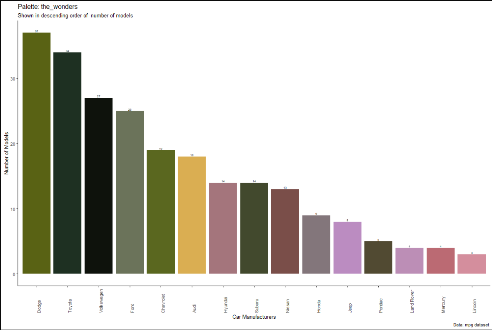

**De Wonderen/The Wonders *(2014)* by Germa Borst** De Wonderen/The
Wonders (2014) by Germa Borst This mural was painted by Germa Borst. It
was commissioned by the inhabitant of the house and subsidized by the
City of Utrecht. In the neighborhood where the house stands the family
Engelen (translated Angels) used to live, and there was a nunnery named
Bethlehem. Both the family as well as the nunnery devoted their lives to
helping those around them. Enchanted with the neighborhood, Germa got in
touch with Boukje Lootsma, who at the time wrote modern day fairy tales.
They both wanted to immortalize and commemorate the local history by
means of murals and history based fairy tales. This particular painting
takes place in the 16th century and tells the story of the women living
in the nunnery that have visions of wonders which they convey to Papal
State. One of the nuns is different and part of her special story is
depicted here. <br> *Photo from [muurschilderingen Plus
website](http://www.muurschilderingenplus.nl/sprookjes-van-de-21ste-eeuw-muurschilderingen/)*

<br>


**Train Station from the Past by [De
Verfdokter](https://www.verfdokter.com/).** Paintings like these are
often commissioned by the city and while trains like these aren’t in use
anymore, they often drive through meadows. <br> *Photo from the website
of [De Verfdokter](https://www.verfdokter.com/)*

<br>


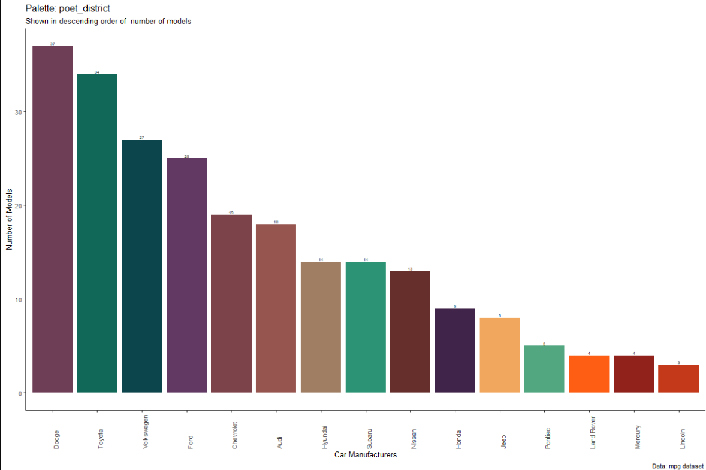

**Verhalen uit de Dichterswijk/Stories from the Dichterswijk by [Munir
de Vries](https://www.instagram.com/munir_de_vries/?hl=en).**

A neighborhood is more than buildings and shops. It is the home of a
large number of different people who all carry a different story with
them. A perfect example is [Ed, a
boatman](http://munirdevries.com/Verhalen-uit-de-Dichterswijk) who tells
stories of the city’s topography, and
[Mr. Braam](http://munirdevries.com/Verhalen-uit-de-Dichterswijk) who
allowed his neighbor to pick leaves from his grape tree, only to have
him show up the next day sharing in the meal which he made with the
leaves. The translated name of the neighborhood is Poet District which
seems more than fitting. <br> *Photo from website of [Munir de
Vries](http://munirdevries.com/Gemeente-Utrecht)*

<br>


**Nijntje/Miffy** is probably the far the most popular thing that came
out of Utrecht. This sculpture made by [De Strakke
Hand](https://www.destrakkehand.nl/) however the city also has a shop
dedicated to Miffy items and a Miffy museum. <br> *Photo from the [De
Strakke Hand website](https://www.destrakkehand.nl/nijntje-museum)*

<br>


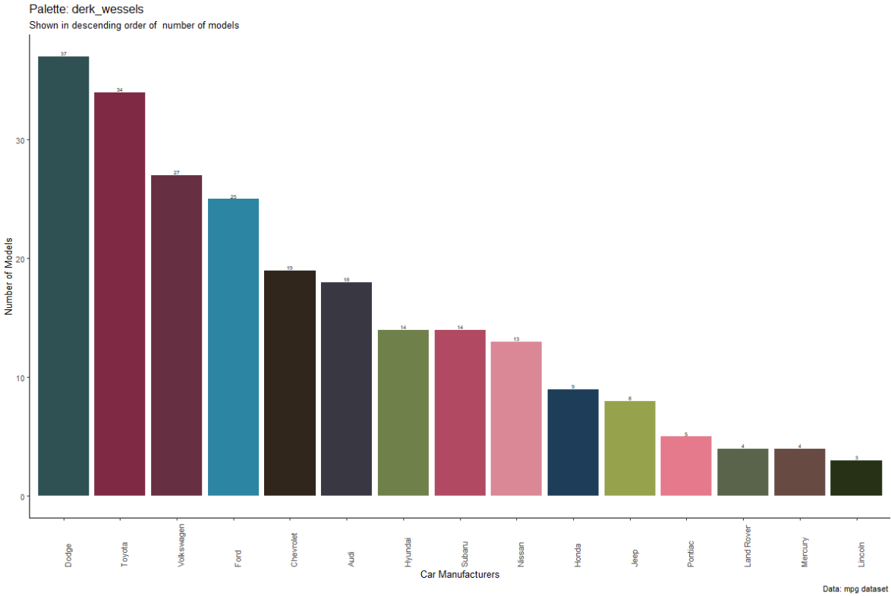

**Derk** by [Derk
Wessels](https://www.wijdedoelen.nl/grafiek-kunstenaars/derk-wessels/)
and [Jan is De Man](https://www.instagram.com/janisdeman/?hl=en). <br>
*Photo from the funda website*

<br>


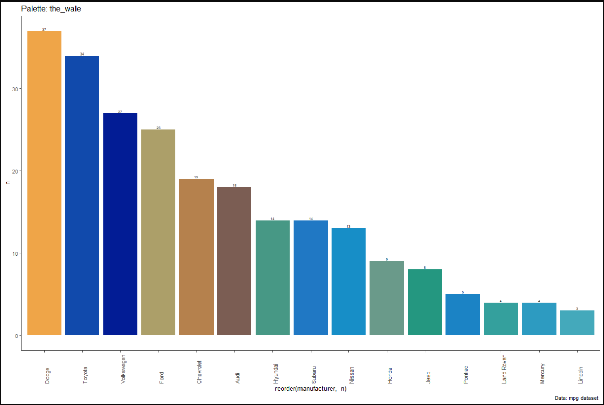

**De Walvis/The Wale** by [Studio KCA](http://www.studiokca.com/).
Officially known as The Skyscraper, this piece of art was made in 2018
as an initiative of Utrecht University’s Faculty of Law, Economics and
Governance. It shows a wale, entirely made of plastic found in the
Pacific Ocean, jumping out of the water in front of the train station.
The city is often in discussion about sustainability and has also
started growing plants above bus shelters and was [pronounced the most
sustainable city in the
country](https://www.change.inc/infra/utrecht-duurzaamste-gemeente-van-nederland-27415).
In 2019 however the wale was dissasembled and shiped to Singapore. <br>
*Photo from website hetkanWEL*

<br>


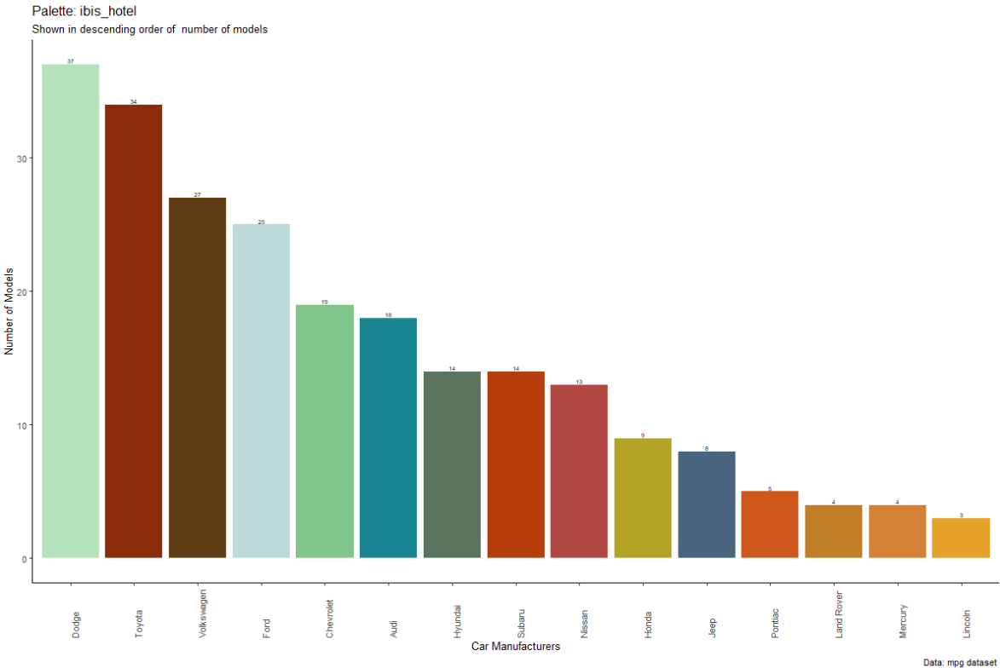

**Glimpse Into The Past at the Ibis Hotel at Bizetlaan** by [De Strakke
Hand](https://www.destrakkehand.nl/). The painting above the Ibis Hotel
shows a person peaking behind the curtains to see how the city looked in
the past. A man on a horse is crossing the bridge, likely going to his
house while several people are crossing the stream by boat. This
painting also shows a role of maritime travel in Dutch history. <br>
*Photo from the newspaper website AD*

<br>


**De Gansstraat** by [De Strakke Hand](https://www.destrakkehand.nl/).
Translated the name of this street is *The Geese street* which is why a
mural of geese was painted. <br> *Photo from the Oud Utrecht site*

<br>


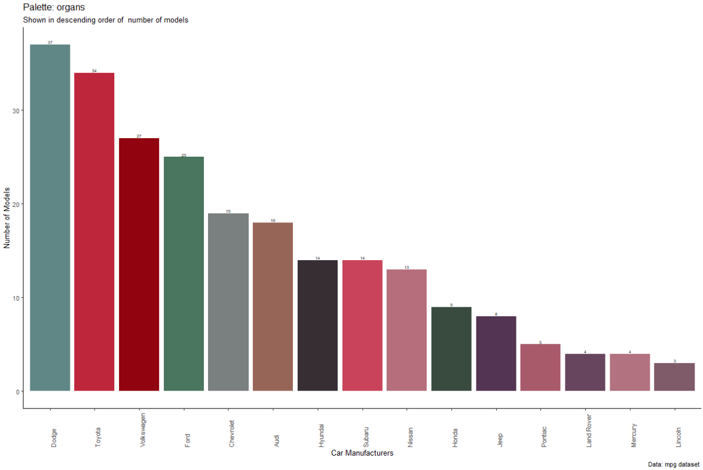

**3D streetart** by [Leon Keer](https://www.instagram.com/leonkeer/).
<br> *Photo from the [droomplekken
website](https://www.droomplekken.nl/nieuws/artiest-leon-keer-corona-street-art-leidsche-rijn-utrecht/)*

<br>


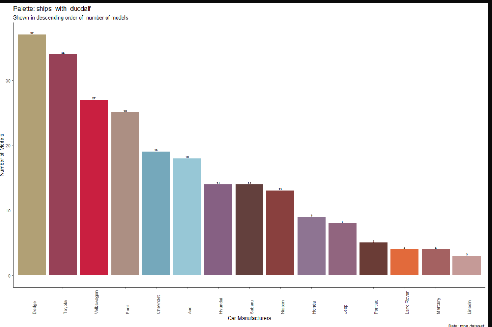

**Ducdalf met Schepen/Ships with Ducdalf (1978).** by Anne P. Boer. In
the Adelaarsstraat (translated Eagle street) stands the oldest street
art in the city! Just as the mural at the Ibis Hotel shows, maritime
traffic has contributed greatly to Dutch history and has extended itself
today to water research at several institutes and universities. <br>
*Photo from [Open Art Utrecht
website](https://www.kunstinopenbareruimte-utrecht.nl/kunstwerken/schepen-met-ducdalf)*

<br>


**Vogelebuurt** by [Jan is De
Man](https://www.instagram.com/janisdeman/?hl=en). Birds play a large
part in the city and many streets are named after a particular bird
kind. Translated the name of the neighborhood is *Bird Neighborhood* and
the artist paid homage to this by painting a bird flying to its bird
house. <br> *Photo from website
[travellust](https://www.travellust.nl/street-art-in-utrecht/)*

<br>


**Mural above the grocery shop** by [Jan is De
Man](https://www.instagram.com/janisdeman/?hl=en). Commissioned by one
of the largest grocery shops in the country, the Albert Heijn (AH), a
number of fruits and vegetables have been painted above the shop. <br>
*Photo from the [Oud Utrecht
website](https://www.oud-utrecht.nl/wat-doen-wij/publicaties/inspirerend-oud-utrecht/666-route-langs-muurschilderingen)*

<br>


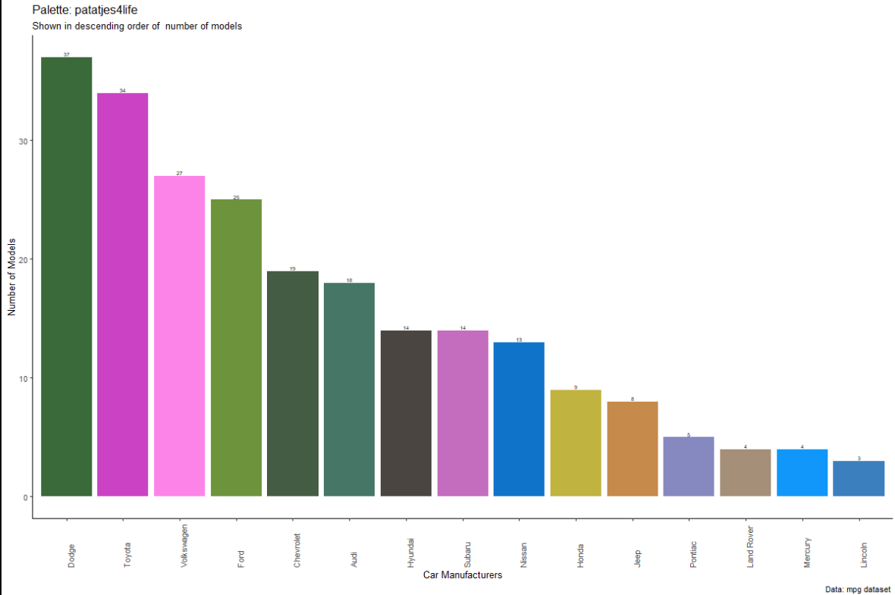

**Electricity boxes in the city center** by
[patatjes4life](https://www.instagram.com/accounts/login/?next=/patatjes4life/).
Initiative of the city ambassador group Thirty030, electrical boxes in
the city were painted to make them more cheerful. <br> *Photo from the
[thirty030 website](https://thirty030.nl/vankastjenaarcanvasje-3/)*

<br>

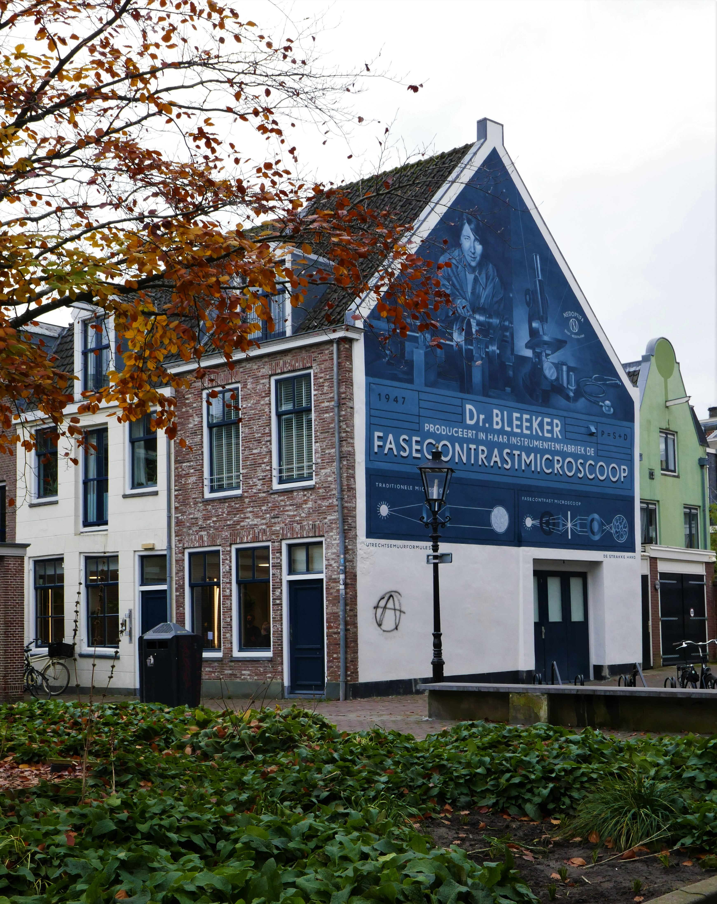


**Faseconstractmicroscoop/Phase Constract Microscope of Dr. Bleeker** by
[De Strakke Hand](https://www.destrakkehand.nl/). This is a wall mural
of physicist Caroline Bleeker, an alumni of the Utrecht University.
During her time she was one of the only women to pursui a STEM career
and eventuelly started her own company where she hired only women and
produced phase contrast microscopes. <br> *Photo from the [street art
cities
website](https://streetartcities.com/cities/utrecht/markers/40184)*

<br>


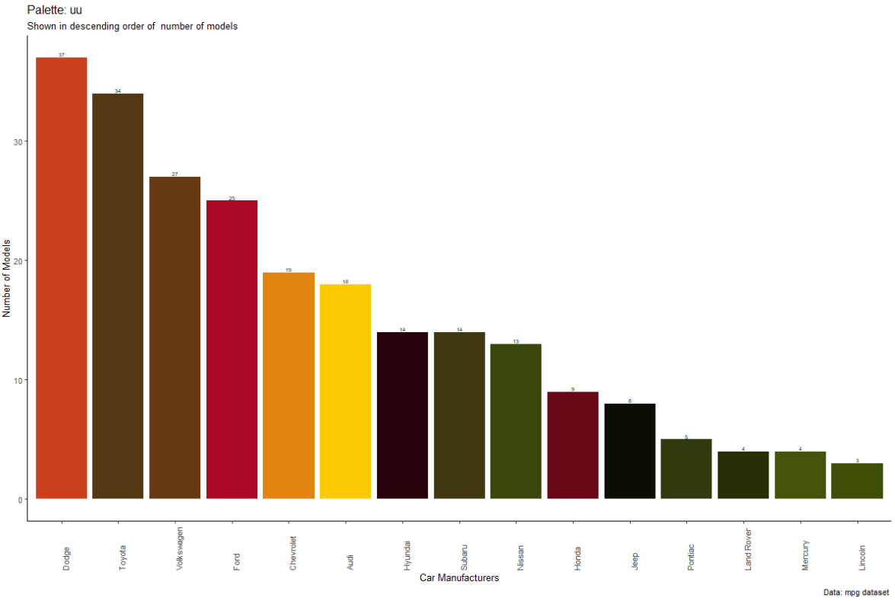

**Utrecht University at the Domplein**. The University Hall stands in
the city center, behind the Dom Church. During the Spanish Occupation of
the Netherlands the auditorium was build and served as a meeting
location for district representatives. In an uprising against the
occupation, the Union of Utrecht was signed which declared the country
independence. <br> *Photo from [youtube
tumbnail](https://www.youtube.com/watch?v=QmkkKRwrqZk)*

<br>


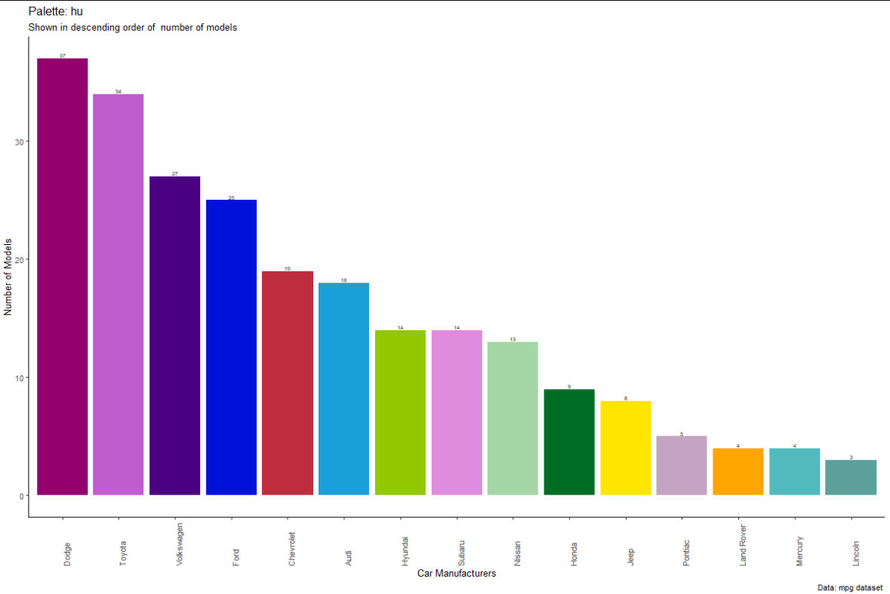

**University of Applied Sciences.** Also known as the HU, this college
is known for encouraging students to participate in school decisions by
hosting union elections to student inviting news anchors to speak on the
national elections. In 2021 the college painted a rainbow crosswalk in
front of the school, which now is the largest in the world! <br> *Photo
from the [duic
website](https://www.duic.nl/algemeen/jongeren-in-utrecht-gaan-drie-uur-op-een-verhoging-staan-voor-aandacht-mentale-gezondheid/)*

## Sources

-   [Hogeschool Utrecht/Institute for Life
    Sciences](https://www.internationalhu.com/campus-utrecht-science-park)

-   [Thirty030,
    Patatjes4Life](https://thirty030.nl/vankastjenaarcanvasje-3/)

-   [De Wonderen/The Wonders in Pijlsweerd, Boukje
    Lootsma](http://www.muurschilderingenplus.nl/sprookjes-van-de-21ste-eeuw-muurschilderingen/#lightbox%5Bauto_group1%5D/8/)

-   [Croeselaan, Munir de
    Vries](www.duic.nl/cultuur/gigantische-muurschildering-verhalen-bewoners-croeselaan/)

-   [Lauwerecht 55, Jan is De
    Man](https://indebuurt.nl/utrecht/nieuws/worden-we-vrolijk-van-utrecht-heeft-er-een-supertoffe-muurschildering-bij~86664/)

-   [Ducdalf met Schepen (1978)/Ducdalf with Ships (1978), Anne P. boer
    in the
    Adelaarstraat](https://www.kunstinopenbareruimte-utrecht.nl/kunstwerken/schepen-met-ducdalf)

-   [Het Balkon (1979)/The Balcony (1979) in the Adelaarstraat, Hans van
    der
    Plas](https://www.kunstinopenbareruimte-utrecht.nl/kunstwerken/drieluik)

-   [Celestial Teapot, Lily van der
    Stokker](https://www.kunstinopenbareruimte-utrecht.nl/kunstwerken/celestial-teapot)

-   [Nijntje/Miffy](https://www.youtube.com/watch?v=oiUu6kLGVMA)

-   [Amsterdamsestraatweg367](https://girlswanderlust.com/exploring-street-art-in-utrecht/)

-   [Amsterdamse straatweg, Jan is de
    Man](https://girlswanderlust.com/exploring-street-art-in-utrecht/)

-   [Otterstraat 116, De
    Verfdokter](https://www.oud-utrecht.nl/wat-doen-wij/publicaties/inspirerend-oud-utrecht/666-route-langs-muurschilderingen)

-   [Van Alphenplein, De
    Verfdokter](https://www.nieuws030.nl/nieuws/de-verfdokter-is-goed-bezig/)

-   [Gansstraat 64, De
    Strakkehand](https://www.oud-utrecht.nl/wat-doen-wij/publicaties/inspirerend-oud-utrecht/666-route-langs-muurschilderingen)

-   [University Utrecht,
    Domplein](https://www.youtube.com/watch?v=QmkkKRwrqZk)

-   [Berlijnplein](https://www.duic.nl/opmerkelijk/bijzondere-3d-vloerschildering-van-bekende-straatkunstenaar-leon-keer-bij-berlijnplein/)

-   [Bizetlaan, De Strakke
    Hand](https://www.duic.nl/algemeen/muurschildering-geeft-doorkijkje-naar-historisch-den-hommel/)

-   [De Walvis/The
    Wale](https://www.uu.nl/organisatie/faculteit-recht-economie-bestuur-en-organisatie/samenwerking-en-samenleving/skyscraper)

-   [Fasecontrastmicroscoop/Phase contrast microscopy on Stroweg by De
    Strakke
    Hans](https://www.duic.nl/algemeen/utrecht-heeft-met-deze-nieuwe-muurschildering-in-de-strosteeg-alweer-vierde-muurformule/)

## Future Improvements

-   Increase title size in the graphs
-   Change color order

## Disclaimer

If you have found any errors in the package please inform me.
