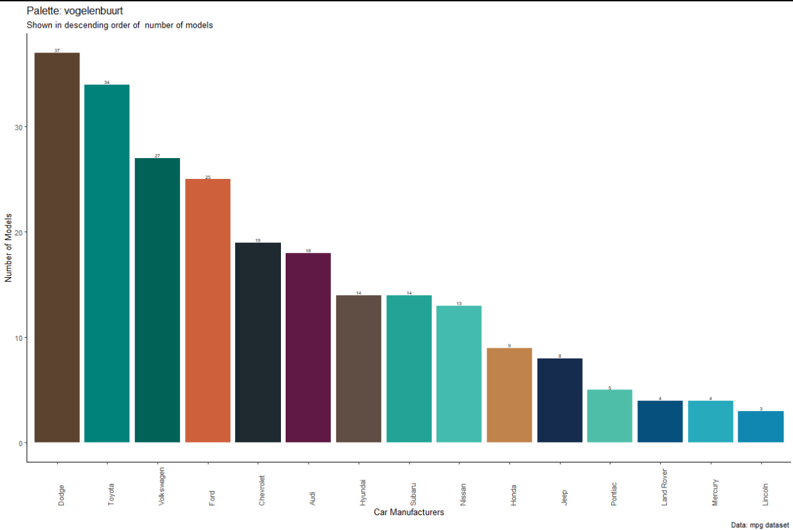

```{r}
library(cowplot)
library(ggplot2)
library(magick)

getwd()
```

{width=30%} {width=30%}

{width=30%}
{width=50%}


```{r fig.width=4, fig.height=6, fig.fullwidth=TRUE}

knitr::include_graphics(c("./images/2020_vogelenbuurt_janisdeman.jpg",
                          "./images/rcolorUtrecht_vogelenbuurt.png"))
```

```{r, fig.fullwidth=TRUE}

```


```{r, fig.width=30, fig.height=30, fig.fullwidth=TRUE}
library(ggplot2)
ggplot(diamonds) + geom_point(aes(carat, price, color=color))
```
